# Uso

Para utilizar el software, al ejecutarlo, lo primero que se debe hacer es iniciar sesión, ya sea como usuario (Recepcionista) o como Administrador del sistema a través de la ventana.

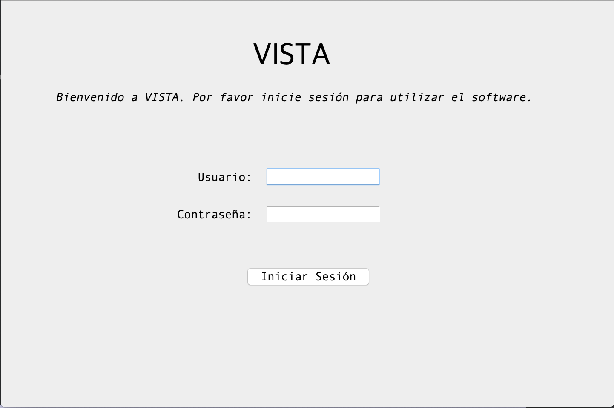

## Administrador

Si inicia sesión como Administrador, puede, además de la operación básica de identificar a los posibles tutores desde la pantalla principal, gestionar a los Recepcionistas: Registrádolos, Editándolos, Eliminándolos o simplemente Consultándolos en el menú desplegable.

Para volver a esta pantalla principal de Administrador haga clic en el botón de `Inicio` de la barra de menú superior.

De igual forma para salir de su sesión haga clic en `Salir` y volvera a la pantalla de inicio de sesión.

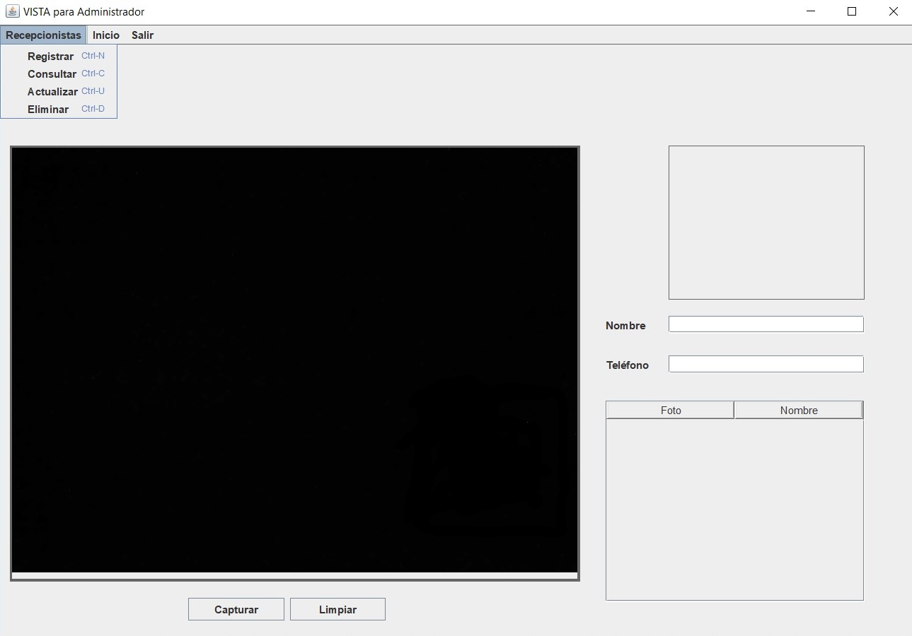

### Para registrar a un Recepcionista:
1. En la barra de menú superior haga clic en `Recepcionistas` y en el menú desplegable vaya a `Registrar`. También puede utilizar el atajo `Ctrl+N` y a continuación observará la siguiente pantalla:

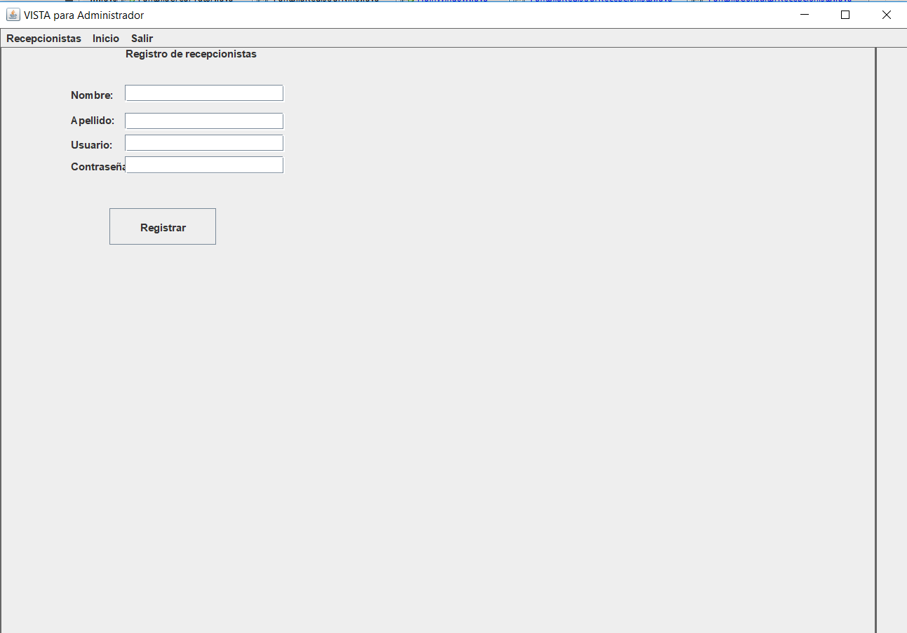

2. Rellene los campos correspondientes y haga clic en el botón `Registrar` de la pantalla.

### Para actualizar la información un Recepcionista ya registrado:

1. En la barra de menú superior haga clic en `Recepcionistas` y en el menú desplegable vaya a `Actualizar`. También puede utilizar el atajo `Ctrl+U` y a continuación observará la siguiente pantalla:

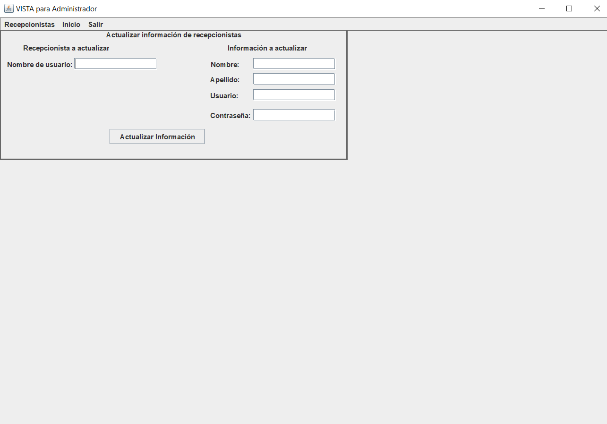

2. Escribe en el área de **Recepcionista a actualizar** el nombre de usuario del recepcionista al que se le quiere editar algún dato.

3. En el área de **Información a actualizar** escriba en el campo correspondiente la información que desea actualizar de este usuario.

4. Una vez que haya escrito esta información, haga clic en el botón `Actualizar información` y se guardará esa información en la base de datos.

### Para Eliminar un Recepcionista:

1. En la barra de menú superior haga clic en `Recepcionistas` y en el menú desplegable vaya a `Eliminar`. También puede utilizar el atajo `Ctrl+D` y a continuación observará la siguiente pantalla:

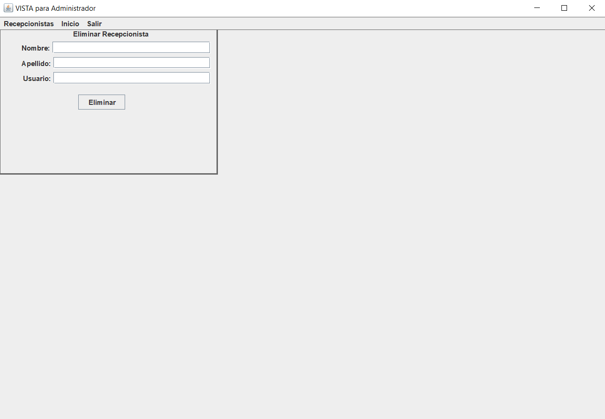

2. Rellene todos los campos de información del recepcionista que desea eliminar de la base de datos.

3. Haga clic en el botón `Eliminar` que se encuentra debajo de los campos de información en la ventana y este recepcionista se habrá eliminado de la base de datos.

### Para consultar los Recepcionistas existentes:

En la barra de menú superior haga clic en `Recepcionistas` y en el menú desplegable vaya a `Consultar`. También puede utilizar el atajo `Ctrl+C` y a continuación observará la siguiente pantalla:

Si desea buscar Recepcionistas por Nombre y/o Apellido:

1. Seleccione el CheckBox de **`Buscar`** y escriba en los campos la información del recepcionista que busca.

2. Haga clic en el botón de `Consultar`.

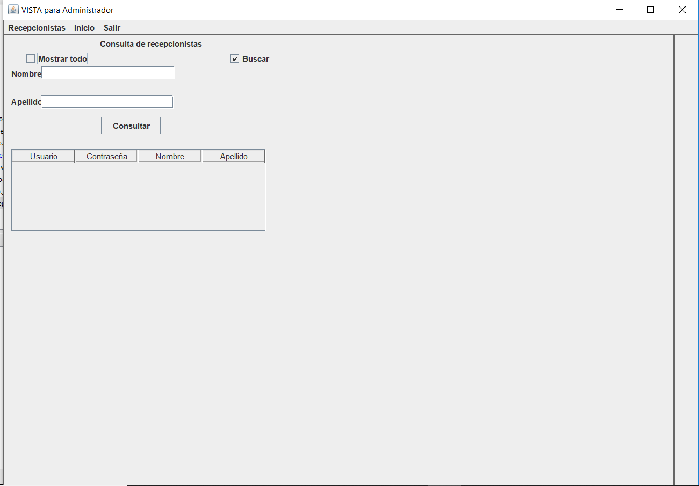

Si desea consultar todos los Recepcionistas registrados en la base de datos, simplemente selecccione el CheckBox de **`Mostrar Todo`**.

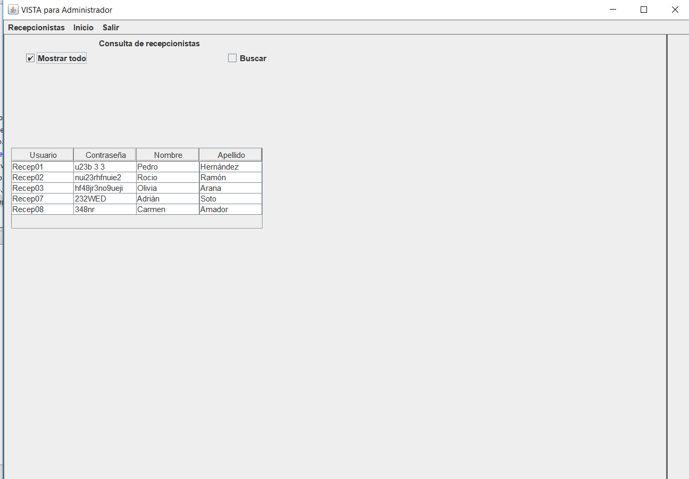

## Recepcionista

Por otro lado si inicia sesión como Recepcionista, puede gestionar a los Niños, Registrádolos, Editándolos, Eliminándolos o simplemente Consultándolos. Además de la tarea del prpópisto principal del software que es el de identificar a los tutores.

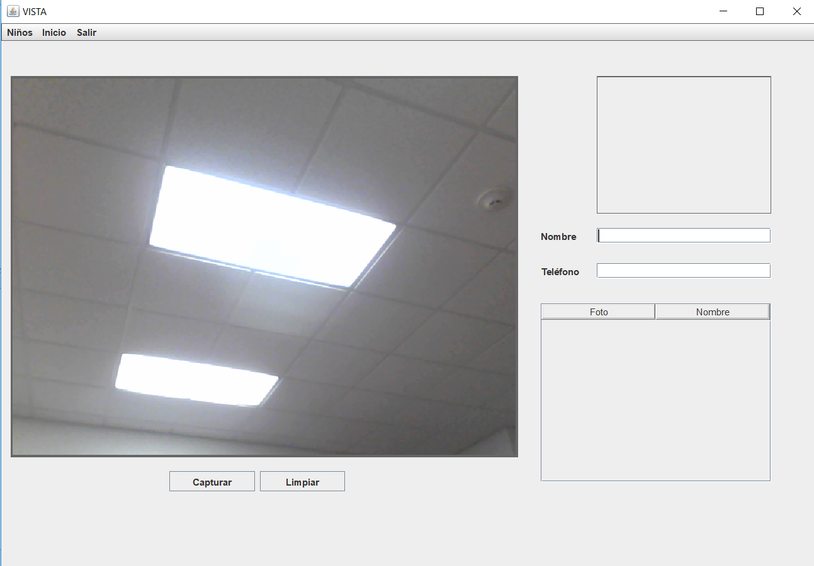

En la barra de menú superior encontrará los botones de `Inicio` para poder volver a la pantalla principal de recepcionista, `Salir` para abandonar la sesión y volver a la pantalla de inicio de sesión, así como también un menú desplegable en el botón de `Niños` donde encontrará opciones para gestionar el registro de los infantes en la base de datos.

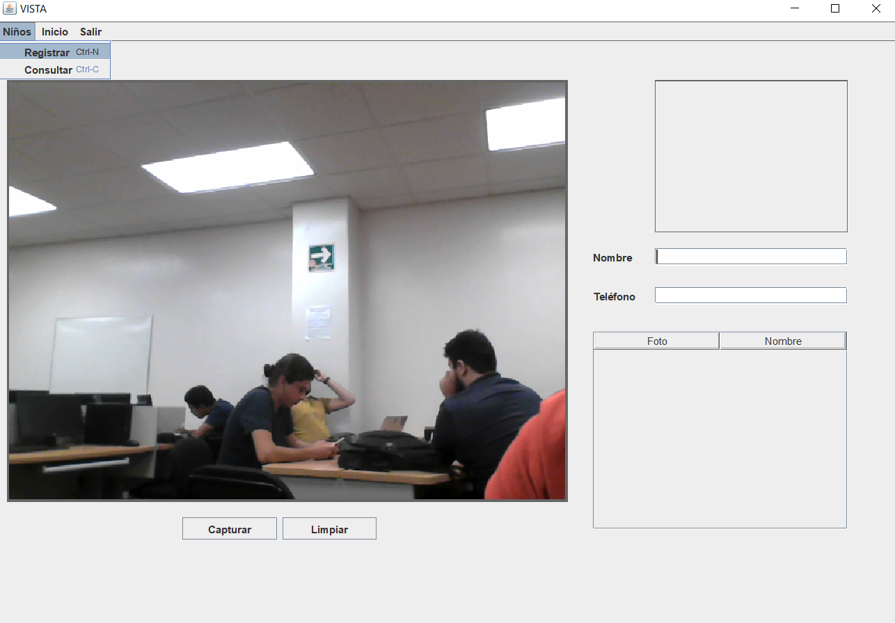

### Registrar Niño

Para registrar a algún niño en la base de datos:

1. En la barra de menú superior haga clic en `Niños` y en el menú desplegable vaya a `Registrar`. También puede utilizar el atajo `Ctrl+N` y a continuación observará la siguiente pantalla:

2. Rellene todos los campos de información del infante y tomele la foto al niño o agréguela desde sus archivos de computadora.

(Ejemplo de la pantalla cuando selecciona tomar foto al niño)

3. Haga clic en `Siguiente` y observará la siguiente pantalla.

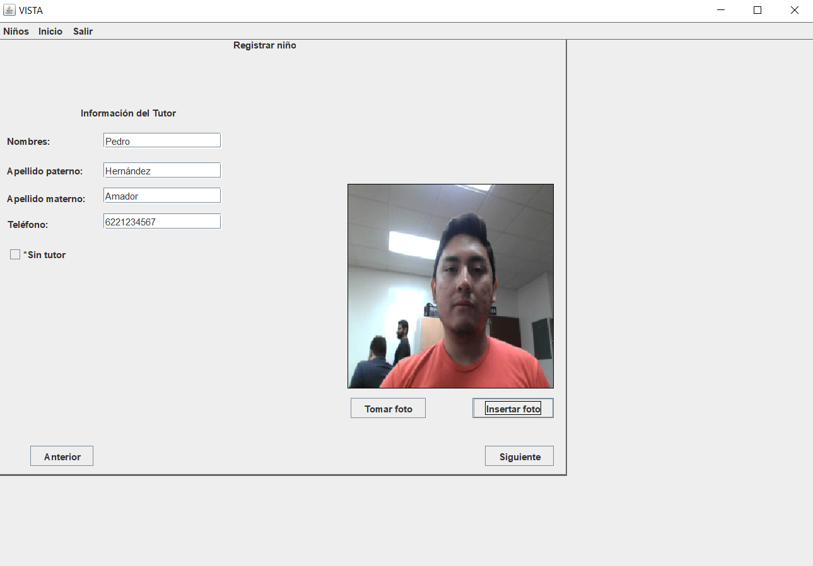

4. Rellene los campos de información del tutor del niño a registrar e inserte o tome la foto de este tutor para que se registre su rostro en la base de datos. O puede seleccionar el campo `Sin tutor` para registrar a un niño sin algún tutor, que posteriormente tendrá que ser registrado para que un adulto pueda llevárselo de la estancia.

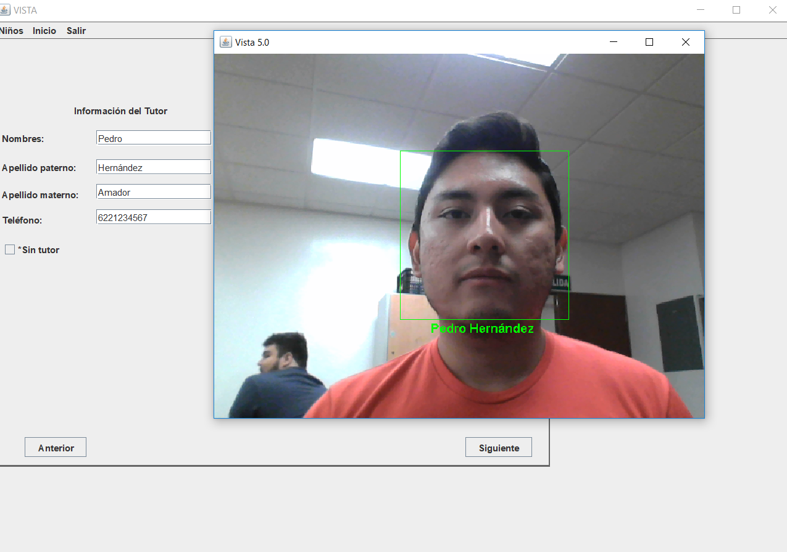

Una vez estos pasos realizados, el niño o la niña podrá reunirse con su tutor a la salida de la estancia. Pero además a través de este mismo registro puede decidir si agregar más adultos autorizados de llevarse al infante o si simplemente se registrará con la información ya proporcionada.

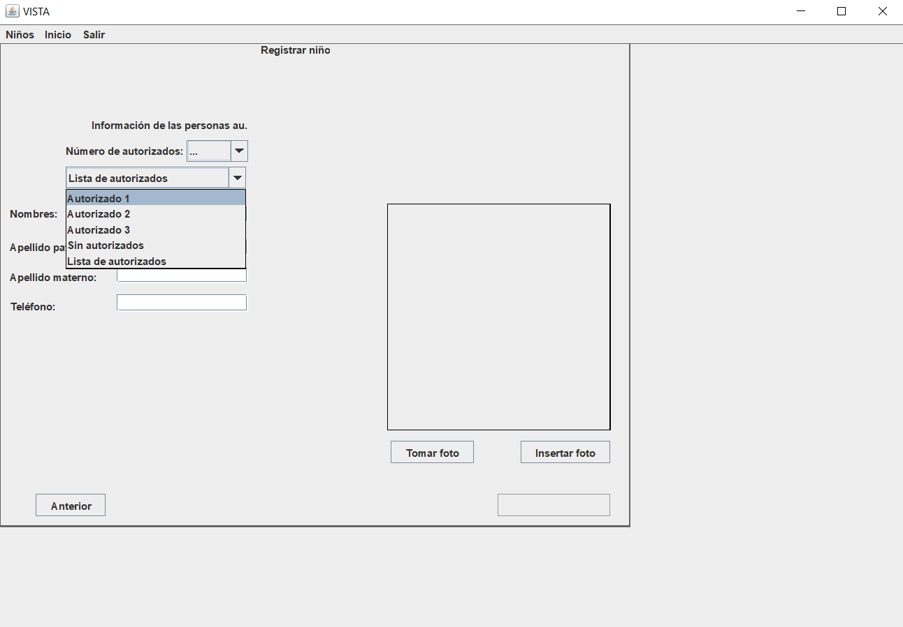

Para registrar al infante sin demás autorizados haga clic en `Sin autorizados` en el menú desplegable y seleccione `Finalizar registro`.

##### Agregar un autorizado desde el registro:

5. En el menú desplegable seleccione el número de autorizados y rellene los campos de información de cada uno, de manera análoga al registro de tutores.

En el siguiente ejemplo se seleccionan dos autorizados:

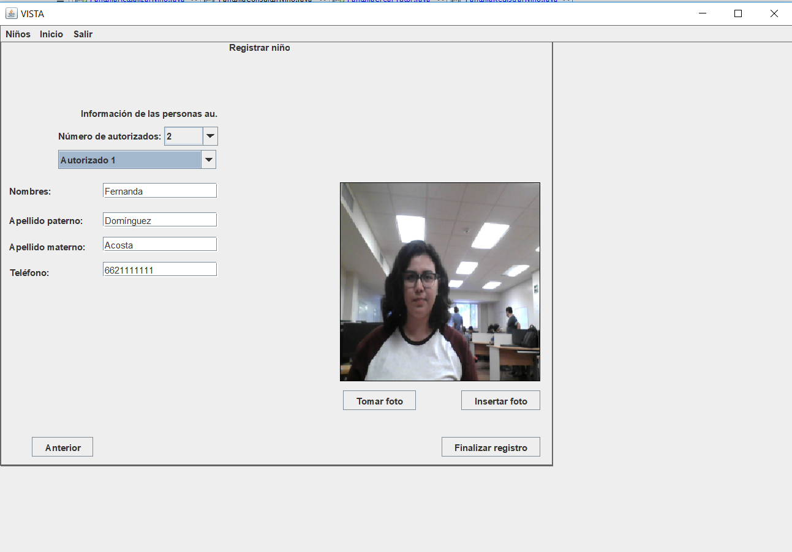

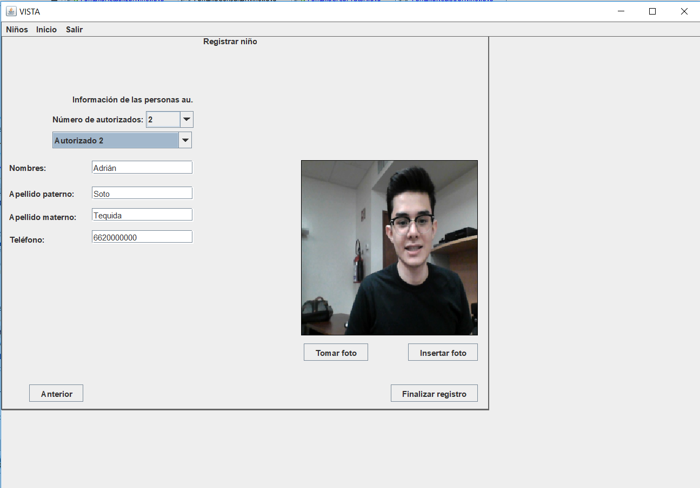

6. Una vez agregada la información de los autorizados seleccione `Finalizar registro` y confirme la información proporcionada para el registro.

7. Por último obtendrá el siguiente mensaje si ha realizado correctamente el proceso.

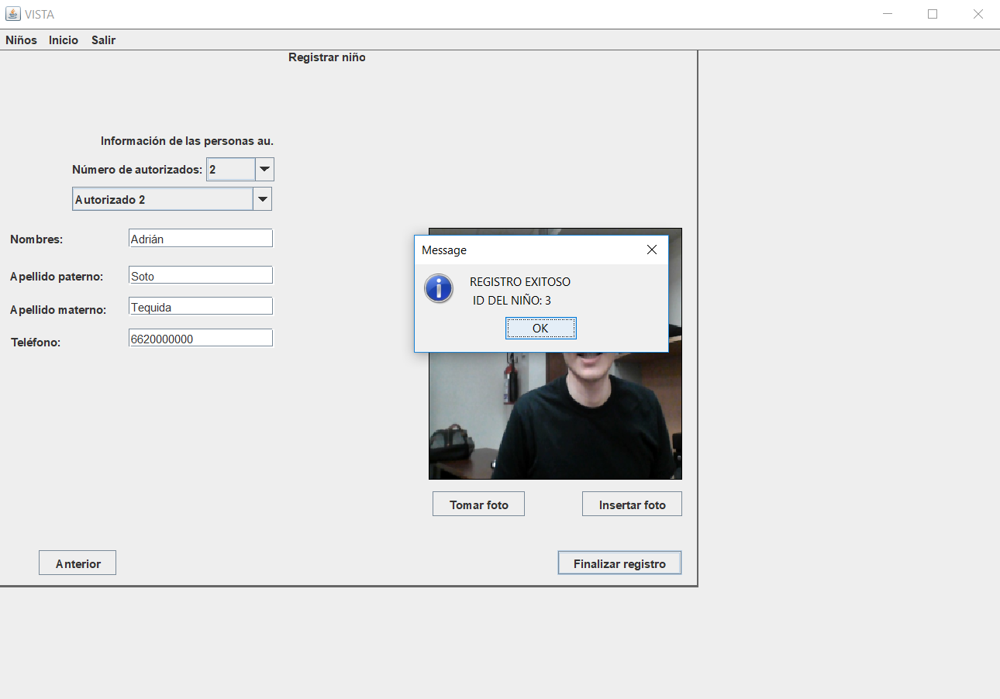

### Consultar información de los niños registrados en la base de datos

Para poder ver la información de todos los niños registrados en la base de datos:

1. En la barra de menú superior haga clic en `Niños` y en el menú desplegable vaya a `Consultar`. También puede utilizar el atajo `Ctrl+C` y a continuación observará la siguiente pantalla:

2. Para consultar a los infantes puede buscarlos por **ID** o por **Nombre**. O bien puede seleccionar el CheckBox `Mostrar Todo` para visualizar a todos los niños registrados en la base de datos.

#### Eliminar un Niño o un Autorizado de éste de la base de datos:

Para eliminar a un niño del registro del sistema, éste se deberá haber consultado previamente.

1. En la tabla de resultados de la cosulta seleccione el ícono `X` de la fila del niño que desee eliminar del registro y verá lo siguiente:

Seleccione que Sí para eliminar definitivamente al niño de la base de datos.

Para eliminar al autorizado de un niño, en la tabla de resultados de la consulta seleccione el ícono del lápiz, y obtedrá la siguiente pantalla:

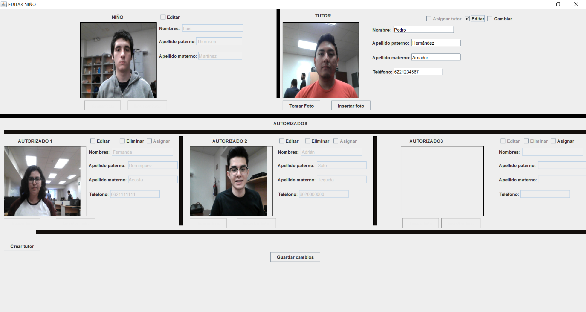

1. Seleccione el CheckBox de `Eliminar` de el o los autorizados a eliminar.

2. Haga clic en el botón de `Guardar Cambios`
#### Editar información de un Niño o un Tutor:

Para editar la información de un niño previamente registrado en el sistema, éste se deberá haber consultado previamente.

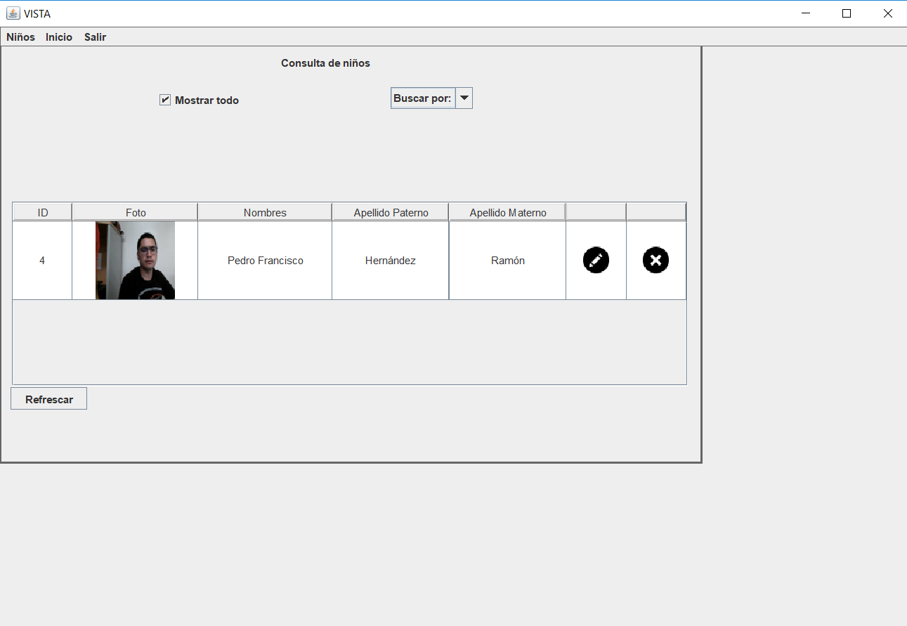

En la tabla de resultados de la consulta, seleccione el ícono del lápiz.

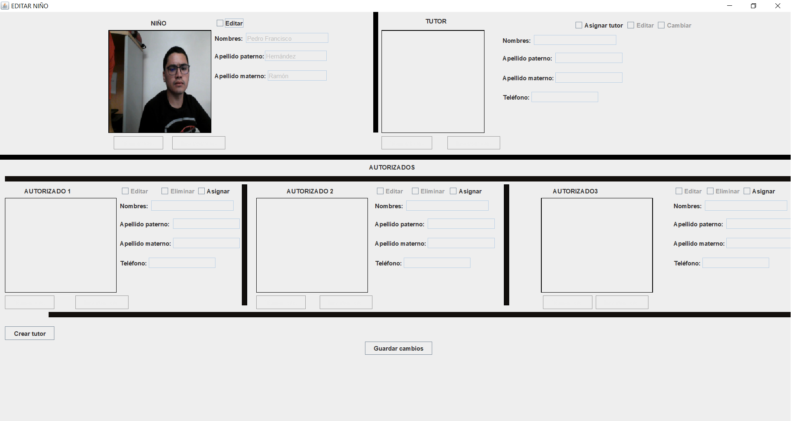

Seleccione el CheckBox de `Editar` en la casilla donde se muestra la información del niño. Así mismo si este niño fue registrado sin tutor, aquí se encontrará la opción para agregarle uno en el CheckBox de `Asignar Tutor`.

Para editar la información de un tutor o bien un autorizado, en esta misma opción seleccione el CheckBox de `Editar` en el recuadro correspondiente. O en su defecto si se desea agregar otro autorizado seleccione el CheckBox de `Asignar` en el recuadro correspondiente a los autorizados y siga el proceso de forma similar a cuando se agrega un tutor desde el registro.

Una vez editada o agregada la información deseada, haga clic en el botón de `Guardar Cambios`.

### Identificar Tutores

Identifica a los adultos como tutores o autorizados de llevarse a algún niño, o en su defecto si el adulto no está registrado en la base de datos, se guarda como un sospechoso.

Para poder realizar la tarea de identificar tanto tutores, autorizados y sospechosos, deberá estar en la pantalla principal de Recepcionista o Administrador. Puede acceder a esta pantalla siempre desde la barra de menú superior con el botón de `Inicio`.

1. Procure tener la cámara posicionada correctamente a una altura donde se puedan apreciar correctamente los rostros de los tutores.

2. Para ver los infantes que tiene asociado un adulto captado por la cámara, haga clic en el botón de `Capturar`

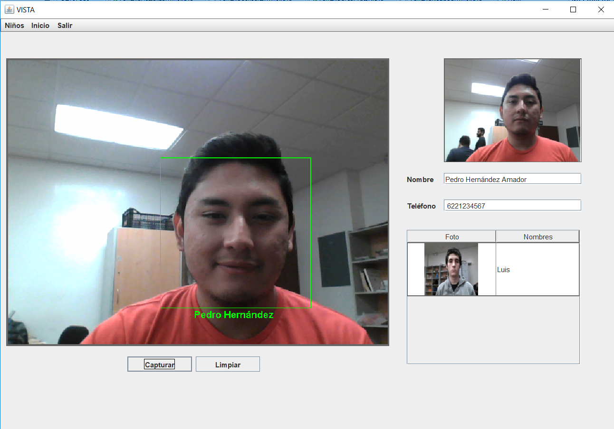

Cuando el adulto no se reconoce cuando seleccione capturar le podrá asignar un nombre para identificarlo y se guardará automáticamente en la bitácora.
